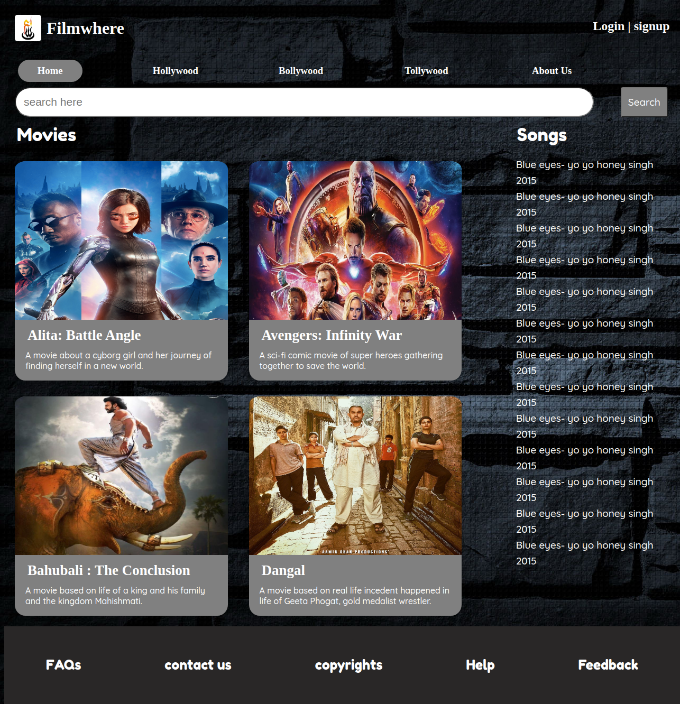
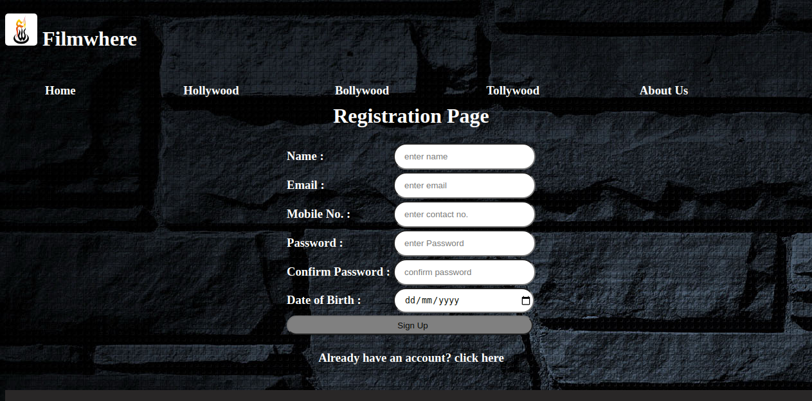
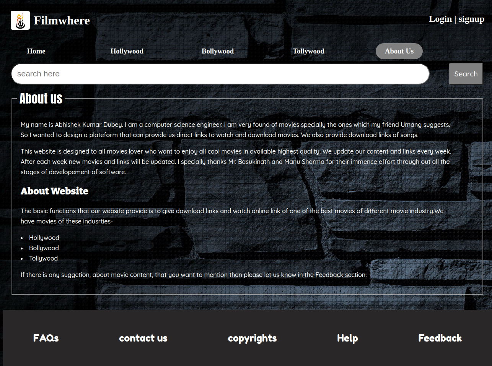
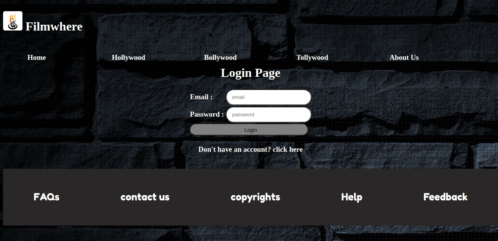
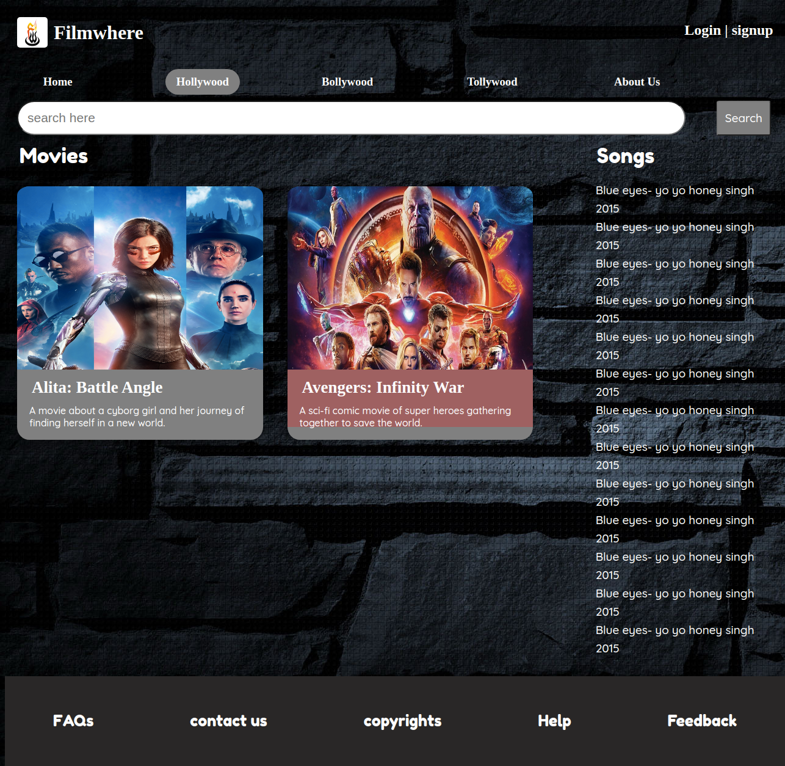

# filmwhere
<a href="https://filmwhere-abhishek.netlify.app">Website Link</a> 
A font-end project of making a template for practice purpose.
In this project, I have focused on making a front-end for a web application. Though it is not fully functionable due to lack of database. I have used HTML, CSS and Javascript in the developement procedure. HTML and CSS are use for designing and Javascript is used for front-end validation of data in Sign up page.
 

 

 

 

 

